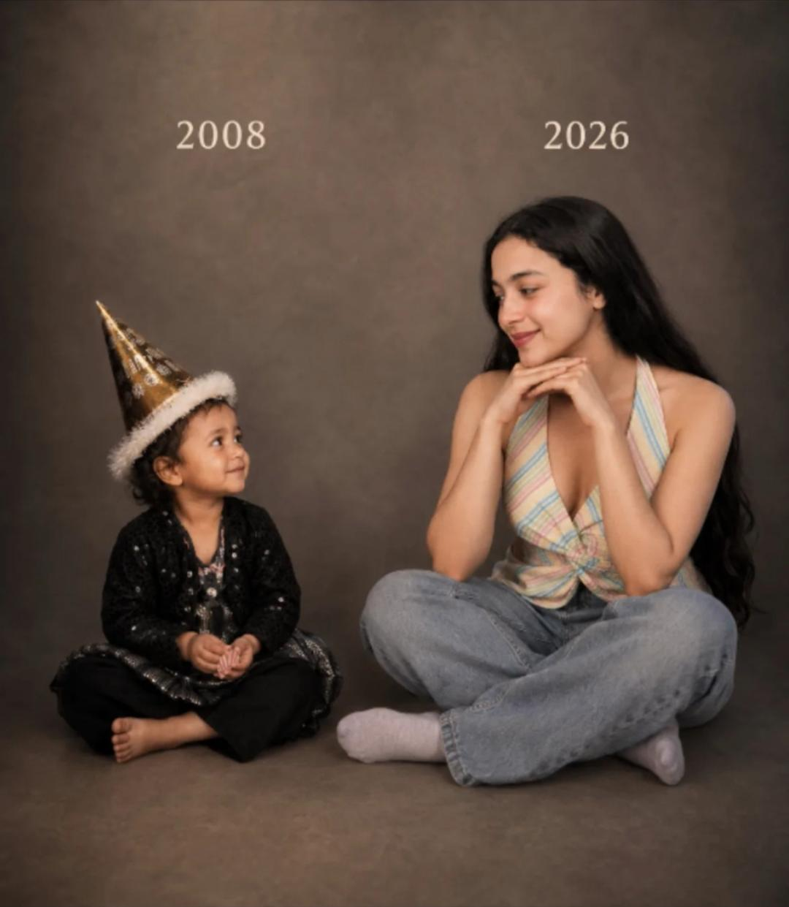
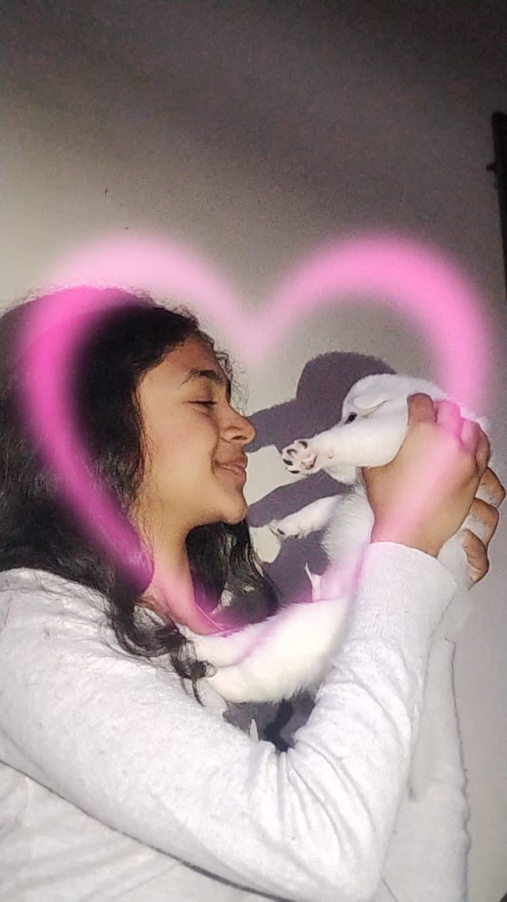
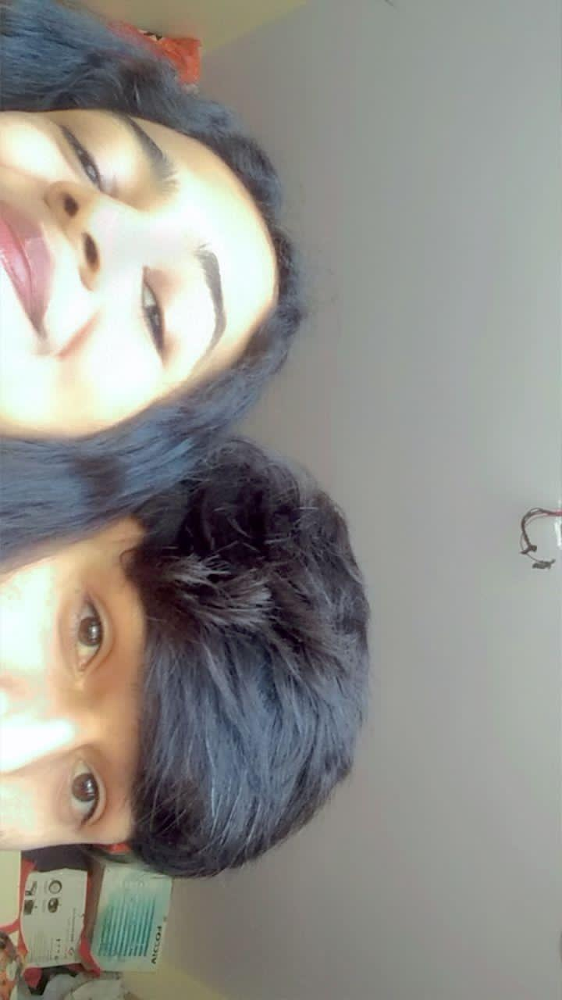

<!DOCTYPE html>
<html lang="en">
<head>
<meta charset="UTF-8">
<meta name="viewport" content="width=device-width, initial-scale=1.0">

<title>Birthday Universe ✨</title>

<link href="https://fonts.googleapis.com/css2?family=Poppins:wght@300;400;500;600;700&display=swap" rel="stylesheet">

</head>

<body>

<!-- ======================================================
POPUP
======================================================= -->

×

<h2 id="popupTitle"></h2>

<!-- ======================================================
PARTICLES
======================================================= -->

<!-- ======================================================
SCENE 1
======================================================= -->

<section class="scene active" id="scene1">

FOR SOMEONE SPECIAL

<h1 class="title">
HAPPY 
BIRTHDAY
</h1>

Happy Birthday Ginni ❤️

Today is all about you,
your smile,
your happiness,
and the beautiful person you are ✨

<button class="btn"
onclick="nextScene('scene1','scene2')">

ENTER THE EXPERIENCE

</button>

</section>

<!-- ======================================================
SCENE 2 MEMORIES
======================================================= -->

<section class="scene" id="scene2">

MEMORIES

<h1 class="title">
OUR 
MEMORIES
</h1>

<h3>Beautiful Moments ❤️</h3>

<h3>Beautiful Energy ✨</h3>

<h3>Forever Memories 🌸</h3>

<button class="btn"
onclick="nextScene('scene2','scene3')">

CONTINUE

</button>

</section>

<!-- ======================================================
SCENE 3 LETTER
======================================================= -->

<section class="scene" id="scene3">

A LETTER

<button class="btn"
onclick="nextScene('scene3','scene4')">

OPEN FLOWERS

</button>

</section>

<!-- ======================================================
SCENE 4 FLOWERS
======================================================= -->

<section class="scene" id="scene4">

FLOWERS FOR YOU

<h1 class="title">
LITTLE 
SURPRISES
</h1>

Roses For You 🌹

A Bouquet Of Happiness 💐

Beautiful Like You ✨

<button class="btn"
onclick="nextScene('scene4','scene5')">

FINAL WISH

</button>

</section>

<!-- ======================================================
SCENE 5 FINAL
======================================================= -->

<section class="scene" id="scene5">

<h1 class="final-title">
HAPPY 
BIRTHDAY GINNI❤️
</h1>

May life always protect your smile.

May your heart always find peace.

May your dreams become reality.

And may you always be surrounded
by beautiful moments and people
who truly deserve you ✨

Forever one of the most beautiful
parts of my memories ❤️

</section>

<!-- ======================================================
MUSIC
======================================================= -->

<button class="music"
onclick="toggleMusic()">

🎵

</button>

<audio id="music" loop>
<source src="assets/music/song.mp3">
</audio>

<!-- ======================================================
JAVASCRIPT
======================================================= -->

</body>
</html>
